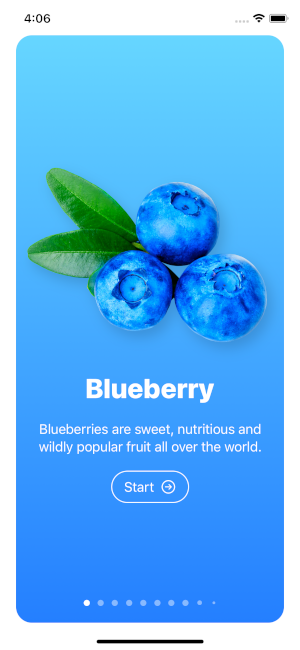
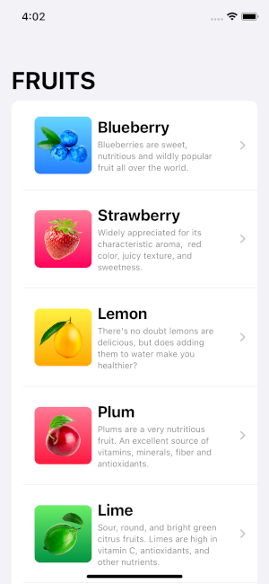

# Fructus App
<div id="top"></div>


<!-- PROJECT LOGO -->
<br />
<div align="center">
 

<h3 align="center">GETTING STARTED WITH SWIFTUI </h3>

  <p align="center">
    Fructus app is an iOS app that shows a list of fruits and its details. <br>
    The main goal of this project is to show you how simple SwiftUI can be as well as helping you get into it. <br> 
  </p>
</div>


<!-- TABLE OF CONTENTS -->
<details>
  <summary>Table of Contents</summary>
  <ol>
    <li>
      <a href="#about-the-project">About The Project</a>
      <ul>
        <li><a href="#built-with">Built With</a></li>
      </ul>
    </li>
    <li>
      <a href="#getting-started">Getting Started</a>
      <ul>
        <li><a href="#prerequisites">Prerequisites</a></li>
        <li><a href="#installation">Installation</a></li>
      </ul>
    </li>
    <li><a href="#usage">Usage</a></li>
    <li><a href="#contributing">Contributing</a></li>
    <li><a href="#contact">Contact</a></li>
  </ol>
</details>


<!-- ABOUT THE PROJECT -->
## About The Project

  Developed by
 `MeenKokoloina`


### Built With

* Swift
* SwiftUI


<p align="right">(<a href="#top">back to top</a>)</p>


<!-- GETTING STARTED -->
## Getting Started


### Prerequisites

No prerequisites needed.

### Installation


2. Clone the repo
   ```sh
   git clone https://github.com/MeenKoloina/fructus-app.git
   ```
3. Set up your provisioning profile and launch the project on Xcode
   <br> And you're good to go ! 

<p align="right">(<a href="#top">back to top</a>)</p>


<!-- USAGE EXAMPLES -->
## Usage

The app has three screens

 <br>
1. Onboarding view with slider. <br>


 <br>
2. List of fruits. <br>

 <br>
3. Details of each fruit. <br>


<!-- CONTRIBUTING -->
## Contributing

Contributions are what make the open source community such an amazing place to learn, inspire, and create. Any contributions you make are **greatly appreciated**.

If you have a suggestion that would make this better, please fork the repo and create a pull request. You can also simply open an issue with the tag "enhancement".
Don't forget to give the project a star! Thanks again!

1. Fork the Project
2. Create your Feature Branch (`git checkout -b feature/AmazingFeature`)
3. Commit your Changes (`git commit -m 'Add some AmazingFeature'`)
4. Push to the Branch (`git push origin feature/AmazingFeature`)
5. Open a Pull Request

<p align="right">(<a href="#top">back to top</a>)</p>


<!-- CONTACT -->
## Contact

MeenKoloina <br> 

All images credits go to Robert Petras

Project Link: [https://github.com/MeenKoloina/fructus-app.git](https://github.com/MeenKoloina/fructus-app.git)

<p align="right">(<a href="#top">back to top</a>)</p>


